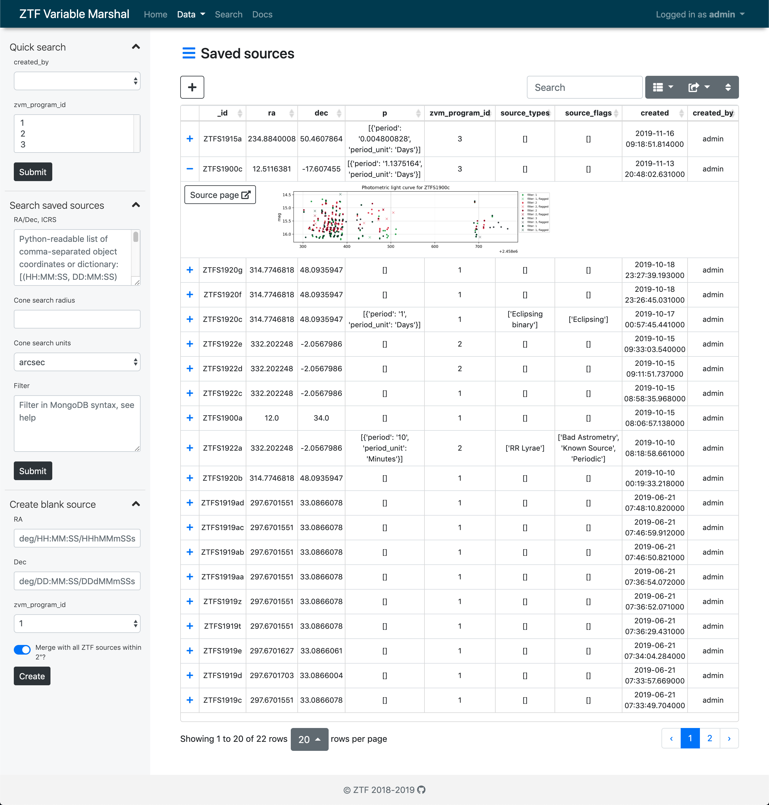
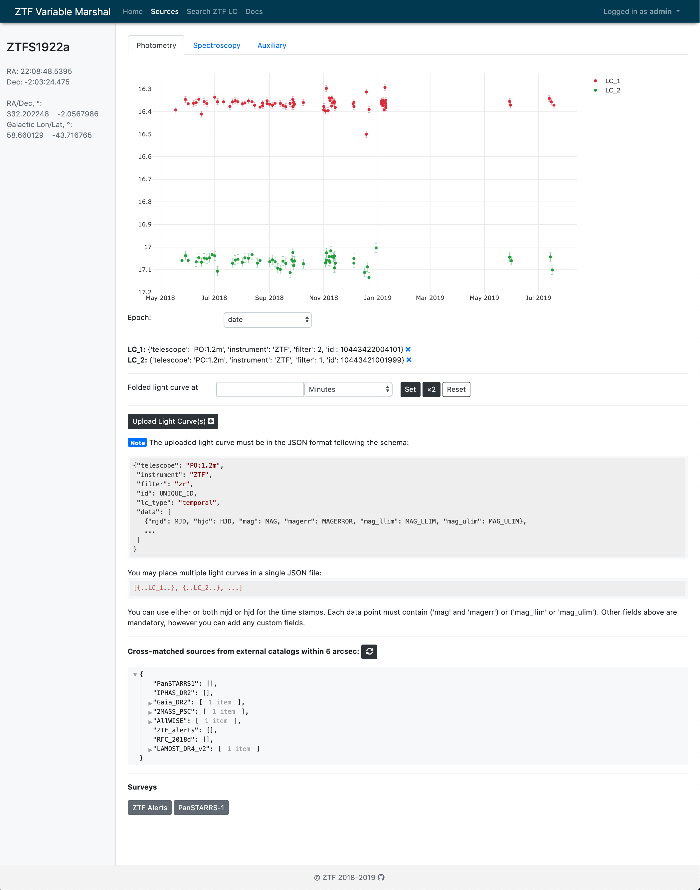
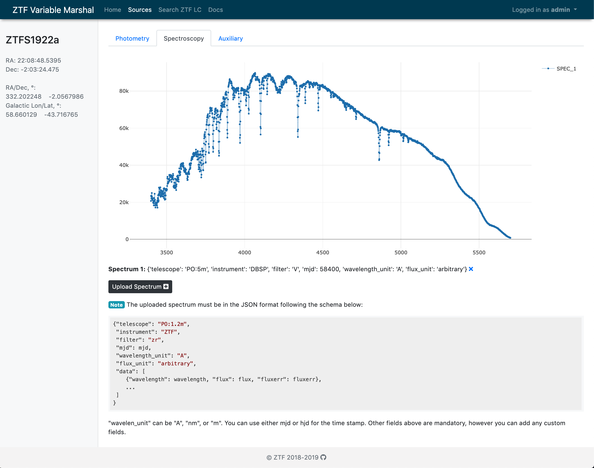
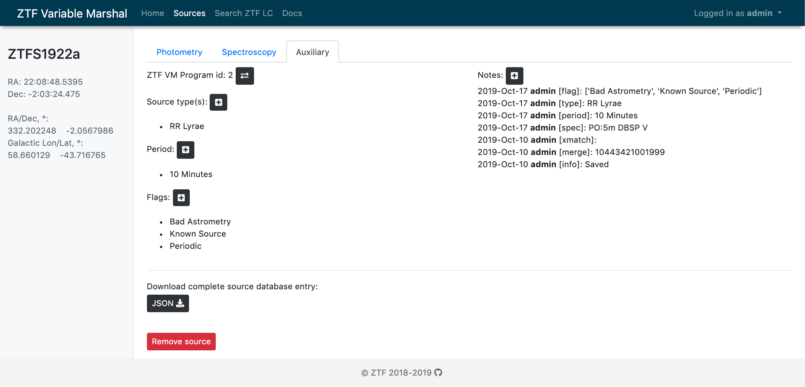

# ZTF Variable Marshal (ZVM)

A dockerized Variable Marshal for [ZTF](https://ztf.caltech.edu) powered by `aiohttp` and `mongodb`.

<table border="0">
<tr>
<th style="width:30%">Search GUI</th>
<th style="width:35%">Source page: Photometry</th>
<th style="width:35%">Source page: Spectroscopy and aux</th>
</tr>
<tr>
<td style="width:30%"></td>
<td style="width:35%"></td>
<td style="width:35%"></td>
</tr>
</table>

## Python client library `zvm`

Install the client library [zvm.py](https://github.com/dmitryduev/ztf-variable-marshal/blob/master/zvm.py), 
with `pip` into your environment:

```bash
pip install git+https://github.com/dmitryduev/ztf-variable-marshal.git
```

`zvm` is very lightweight and only depends on `pymongo` and `requests`.

A tutorial on how to programmatically interact with the ZVM:

See [this jupyter notebook](https://github.com/dmitryduev/ztf-variable-marshal/blob/master/nb/api.ipynb), or 
[](https://colab.research.google.com/github/dmitryduev/ztf-variable-marshal/blob/master/nb/api.ipynb)

---

## Production service  

### Set-up instructions

#### Pre-requisites

Clone the repo and cd to the cloned directory:
```bash
git clone https://github.com/dmitryduev/ztf-variable-marshal.git
cd ztf-variable-marshal
```

Create `secrets.json` with confidential/secret data:
```json
{
  "server" : {
    "admin_username": "ADMIN",
    "admin_password": "PASSWORD"
  },
  "database": {
    "admin": "mongoadmin",
    "admin_pwd": "mongoadminsecret",
    "user": "user",
    "pwd": "pwd"
  },
  "kowalski": {
    "username": "USERNAME",
    "password": "PASSWORD"
  }
}
```

#### Using `docker-compose` (for production)

Change `skipper.caltech.edu` in `docker-compose.yml` and in `traefik/traefik.toml` if necessary. 

Run `docker-compose` to build and start the service (may have to sudo if acme complains):
```bash
sudo docker-compose up --build -d
```

To tear everything down (i.e. stop and remove the containers), run:
```bash
docker-compose down
```

---

#### Using plain `Docker` (for dev/testing)

If you want to use `docker run` instead:

Create a persistent Docker volume for MongoDB and to store data:
```bash
docker volume create ztf_variable_marshal_mongodb
docker volume create ztf_variable_marshal_data
```

Pull, build, and launch the MongoDB container. Feel free to change u/p for the admin, 
but make sure to change `secrets.json` and `docker-compose.yml` correspondingly.
```bash
docker run -d --restart always --name ztf_variable_marshal_mongo_1 -p 27025:27017 \
       -v ztf_variable_marshal_mongodb:/data/db \
       -e MONGO_INITDB_ROOT_USERNAME=mongoadmin -e MONGO_INITDB_ROOT_PASSWORD=mongoadminsecret \
       mongo:latest
```

To connect to the db:
```bash
docker exec -it ztf_variable_marshal_mongo_1 /bin/bash
mongo -u mongoadmin -p mongoadminsecret --authenticationDatabase admin
```

Build and launch the app container:
```bash
docker build --rm -t ztf_variable_marshal:latest -f Dockerfile .
docker run --name ztf_variable_marshal -d --restart always -p 8000:4000 -v ztf_variable_marshal_data:/data --link ztf_variable_marshal_mongo_1:mongo ztf_variable_marshal:latest
# test mode:
docker run -it --rm --name ztf_variable_marshal -p 8000:4000 -v ztf_variable_marshal_data:/data --link ztf_variable_marshal_mongo_1:mongo ztf_variable_marshal:latest

```

`ztf_variable_marshal` will be available on port 8000 of the `Docker` host machine. 
